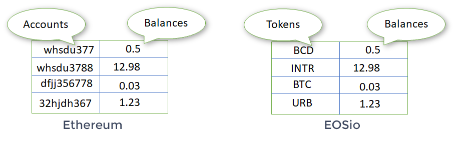

# Introduction
The basic standard API for tokens, on EOSio networks, does not allow practical implementations of non-custodian peer-to-peer applications. The following smart contract, closely inspired from the [ERC-20 Ethereum standard](https://eips.ethereum.org/EIPS/eip-20), allows users to preapprove other account (or smart contracts) to spend a designated amount of funds in there name. To do so, we have implemented two new actions which are added to the standard `eosio.token` contract:

- approve : Give spending privileges to another account
- transferfrom: Spend funds in the name of another account which preapproved the spender

# Ethereum vs EOSio

On the Ethereum platform, tokens are implemented as ledgers with a Solidity smart contract. One token/ledger per contract. These ERC20 ledgers are set as two column tables comprising user accounts and account balances (see left illustration below) and stored in the scope of the contract. Hence, to query all of a users account balances, we need a list of all ERC20 contract addresses of the relevant tokens. 

In contrast, in EOSio networks the standard `eosio.token` contract allows the creation of many tokens. The ledgers are set in a two column table comprising tokens and balances (see right illustration below) which are stored directly in the user's scope. This simplifies the query of all token balances for a user. 

# Table of Content
We provide two repositories:
* [contract](./contract/): Contains the smart contract which is deployed on the eosio chain 
* [javascript](./javascript/): Contains a small module to easily interface our smart contract with eos-transit
