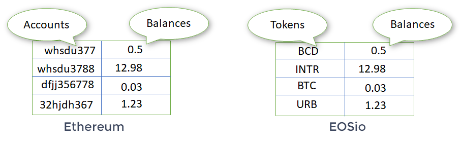

# Introduction
The basic standard API for tokens, on EOSio networks, does not allow practical implementations of non-custodian peer-to-peer applications. The following smart contract, closely inspired by the [ERC-20 Ethereum standard](https://eips.ethereum.org/EIPS/eip-20), allows users to preapprove other accounts (or smart contracts) to spend a designated amount of funds in their name. To do so, we have implemented two new actions that are added to the standard `eosio.token` contract:

- approve: Give spending privileges to another account
- transferfrom: Spend funds in the name of another account which preapproved the spender

# Ethereum vs EOSio

On the Ethereum platform, tokens are implemented as ledgers with a Solidity smart contract. One token/ledger per contract. These ERC20 ledgers are set as two-column tables comprising user accounts and account balances (see left illustration below) and stored in the scope of the contract. Hence, to query all of a user's account balances, we need a list of all ERC20 contract addresses of the relevant tokens. 

In contrast, in EOSio networks the standard `eosio.token` contract allows the creation of many tokens. The ledgers are set in a two-column table comprising tokens and balances (see right illustration below) which are stored directly in the user's scope. This simplifies the query of all token balances for a user. 



# Installation
Clone the directory into WORKDIR:

`git clone https://gitlab.com/Interblockchain/eos-erc20-contract.git`

Move into the directory and compile the code with eosio-cpp from the [EOSIO Contract Development Toolkit](https://github.com/EOSIO/eosio.cdt):

`eosio-cpp basiccontract.cpp -o basiccontract.wasm`

You can now deploy the contract on an [EOS node](https://github.com/EOSIO/eos) (first create a corresponding basic account):

`cleos set contract basic WORKDIR/basiccontract`

# Structures

This contract defines three tables that store the information of the tokens, the user's balances and his allowances.  

### The currency stats table
Each time a create action is called, a new entry is added to the currency stats table. This table is indexed using the token symbol, guaranteeing that each symbol is unique.

The max_supply and issuer properties cannot be changed. The supply is incremented according to the amount of currency that has been issued and is in circulation.

This table is stored in the scope of the contract. The RAM required for this table is paid by the account that deployed the contract (i.e. the contract owner). 

```c++
    struct [[eosio::table]] currency_stats
    {
        asset supply;
        asset max_supply;
        name issuer;

        uint64_t primary_key() const { return supply.symbol.code().raw(); }
    };
```
The full list of existing tokens and their properties can be queried with the command. 

```bash
cleos get table ibclcontract ibclcontract stats
```

### The accounts table
A user`s balance is stored in the accounts table which is stored in the scope of his account. The appropriate way to create this table (or just the relevant row) is for the user to call the open action with the desired token.

The table is indexed using the token symbol, guaranteeing that each symbol is unique. Note, that this table is defined by contract instances, so it is fully possible to have two tokens, from two different contract instances, with the same symbol. Their respective entries will be in two different tables.  

```c++
struct [[eosio::table]] account
    {
        asset balance;

        uint64_t primary_key() const { return balance.symbol.code().raw(); }
    };
```
The full list of token balances, for tokens issued by our contract, for user `owner` can be queried with:
```bash
cleos get table ibclcontract owner accounts
```

### The allowed table
Finally, our contract allows users to preapprove other accounts to spend a designated amount of tokens. These allowances are stored in the allowed table which resides in the scope of the user's account.  

The table is indexed using a special key which is constructed using the spender's name and the token symbol. This guarantees that there can be only one allowance per token and spender. This way of doing things diminish the required computational resources, but there is an associated risk of collision since we merge two uint64 into a new uint64. There is no unique way of doing this. Please see [this analysis](./Notes_BasicContract.pdf) of the collision rate to see that this is not a real issue.

```c++
    struct [[eosio::table]] allowed_struct
    {
        uint64_t key;
        name spender;
        asset quantity;

        uint64_t primary_key() const { return key; }
    };
```
The user `owner` can verify his full list of allowances with the following command:
```bash
cleos get table ibclcontract owner allowed
```

# Actions

## Create Currency
```c++
void create(name issuer, asset maximum_supply)
```
The create action is used to define a new token with an issuer, a symbol, and a maximum supply. This action must be performed with the authority of the account on which the smart contract is deployed. Use the maximum supply to specify the number of required decimals (e.g. "1000.00 XPB" which will create a token with a maximum supply of a thousand, with two decimal places and the symbol XPB). Please see the [EOS documentation](https://developers.eos.io/eosio-cpp/docs/introduction) for more information.

### Parameters:
* issuer: Account which can issue the currency
* maximum_supply: Maximum amount of tokens which can be issued (example: "1000.00 XPB"). This also sets the token name and the number of decimals used by the currency.

## Issue
```c++
void issue(name to, asset quantity, string memo)
```
The issue action issues a certain amount of tokens to an account. Each time this action is performed, it raises the supply of the token. When the maximum supply is reached, it is impossible to issue more tokens. This action must be performed with the authority of the issuer account specified when the token was created.

### Parameters
* to: Account which will received the newly minted tokens
* quantity: Amount of tokens to issue (example: "10.00 XPB")
* memo: A simple memo

## Retire funds
```c++
void retire(asset quantity, string memo);
```
The retire action removes a certain amount of tokens from circulation (thus from the issuer`s balance). Each time this action is performed, it lowers the supply of the token. This action must be performed with the authority of the issuer account specified when the token was created.

### Parameters
* quantity: Amount of tokens to retire (example: "10.00 XPB")
* memo: A simple memo

## Transfer funds
```c++
void transfer(name from, name to, asset quantity, string memo)
```
The transfer action transfers tokens from an account `from` to account `to`. This action must be performed with the authority of account `from`. Notice that if account `to` does not possess any of these tokens, this action creates a corresponding accounts table in the scope of `to`. The RAM allocation for this table is paid by `from`.

### Parameters
* from: Account from which to send funds
* to: Account which receives the funds
* quantity: Amount of tokens sent (example: "1.00 XPB")
* memo: A simple memo

## Open 
```c++
void open(name owner, const symbol &symbol, name ram_payer);
```
The open action allows `ram_payer` to create an account for `owner` with zero balance for the token with symbol `symbol` at the expense of `ram_payer`. As mentioned in the transfer and transferfrom actions, RAM must be paid (by the sender) to store the account balances of the receiver when none existed before. This is not ideal. As such, a user can create a null account balance before receiving funds. Must be called with the authority of `ram_payer`.

### Parameters
* owner: Account for which to create an account balance
* symbol: Symbol of the token for which the balance is created
* ram_payer: Account which pays the RAM cost

## Close
```c++
void close(name owner, const symbol &symbol)
```
The close action is the opposite of the open action, it closes the account balance of `owner` for token `symbol`. This frees the stacked RAM. Must be called with the authority of `owner`.

### Parameters
* owner: Account for which to close the balance
* symbol: Symbol of the token for which the balance is closed

## Approve spender
```c++
void approve(name owner, name spender, asset quantity)
```
The approve action is invoked when an account `owner` wishes to give spending privileges to another account, called `spender` here. This allows the `spender` to withdraw from the owner's account, multiple times, up to the quantity specified. This action creates a new table, called allowed, in the scope of the owner. All RAM allocation costs are paid by the `owner`. This table can be viewed using the command: `cleos get table ibclcontract owner allowed`. This action must be called with the authority of `owner`.

### Parameters
* owner: Account which possesses the tokens and permissions
* spender: Account which will receive the spending privileges
* quantity: Amount which the spender can spend on behalf of `owner` (example: "1.00 XPB")
  
## Transferfrom
```c++
void transferfrom(name from, name to, name spender, asset quantity, string memo)
```
Finally, the transferfrom action is used for a withdraw workflow, allowing contracts or other accounts to send tokens on your behalf. For example to make a non-custodian exchange contract which can "deposit" to a contract address on your behalf and/or to charge fees in sub-currencies. The command fails unless the `from` account has deliberately authorized the `spender` via the approve action. Note that if account `to` does not already possess a balance in the specified tokens, an accounts table must be created in its scope. In this case, the RAM allocation costs are paid by the `spender`. Must be called with the authority of the `spender`.

### Parameters
* from: Account from which to send funds
* to: Account which receives the funds
* spender: Account which has the spending privileges
* quantity: Amount of tokens sent (example: "1.00 XPB")
* memo: A simple memo

# Prerequisite
* EOSIO Contract Development Toolkit: install from [here](https://github.com/EOSIO/eosio.cdt)
* An EOS node: install from [here](https://github.com/EOSIO/eos)
